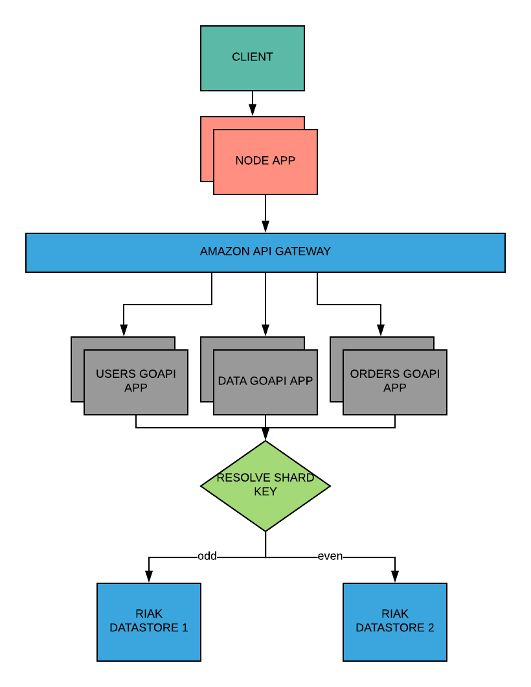

# CMPE 281 - Team Hackathon Project 

## TEAM CLOUDBURST 

1.Indira Bobburi 
2.Manasa Yedire 
3.Aman Ojha  
4.Kalikalyan Dash 
5.Viraj Nilakh 

## ARCHITECTURE DIAGRAM 

## DESCRIPTION: 
1.The client 
Technology Stack: Nodejs, React, Redux 
The client will take the user input and cascade the request to service A

2.Service A 
Technology Stack:Nodejs 
This layer will resolve the nature of the request and cascade it to appropriate microservice.

3.The gateway 
Technology Stack: KONG/ AMAZON 
The gateway will redirect the request to appropriate datastore as per the shard key

4.The datastore
Technology Stack: Cassandra 
The customer information will be persisted in the datastores. Each store will be collection of 5 nodes capable of handling network partition.

**AKF Scale Cube** 
**X-axis scaling:** The horizontal duplication involves scaling an application by running clones of the application on AWS behind an AWS elastic load balancer  
**Y-axis scaling:** The functional decomposition is achieved by using microservices architecture. The verb-based decomposition approach is used where each service is implemented independently.  
**Z-axis scaling:** The data is shared based on the zipcodes. The datastore will be shared by all the microservices. In order to retain the isolation of each service, the tables will be granted appropraite permissions 
